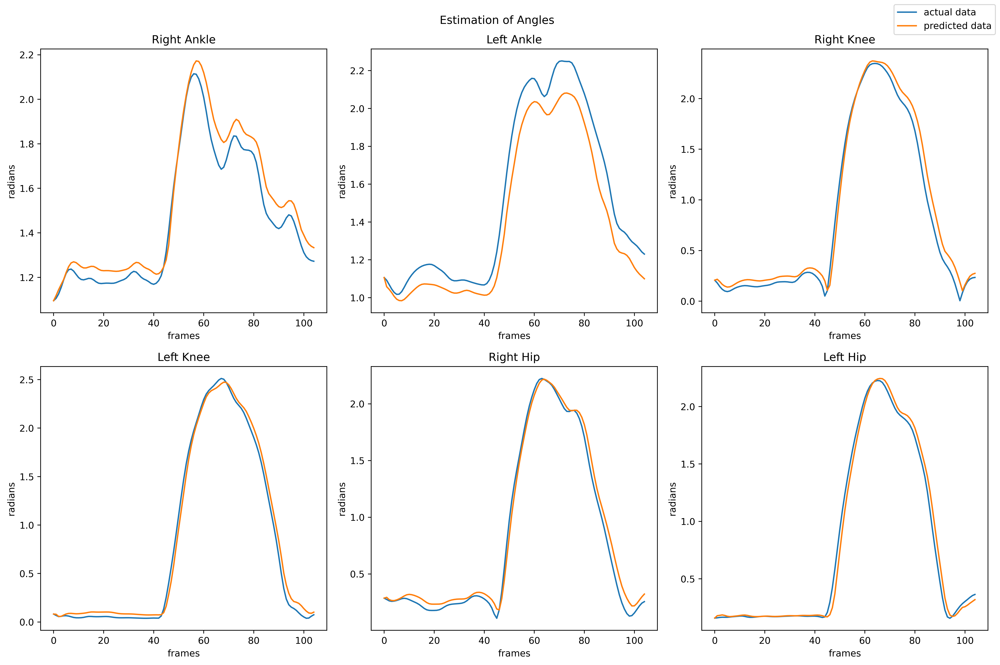

# Squat Classification and Correction Model

## Introduction
This project focuses on the classification and correction of squat exercises, a fundamental movement in athletics and fitness. Using advanced computer vision and deep learning techniques, our method achieves two main goals:

1. Classification of different squat types with 96% accuracy using MediaPipe for pose estimation and a Bi-CGRU model.
2. Correction of improperly performed squats using a custom deep learning-based regression model, achieving 99% accuracy.

Our approach outperforms existing state-of-the-art methods in both quantitative and qualitative assessments. It provides users with insights into their movement biomechanics and offers recommendations for improving form, focusing on key angles and posture alignments.

## Methodology

### Squat Classification

The model architecture for squat classification consists of:

1. A CNN block
2. A stack of three bi-directional GRU units
3. A 'Luong' attention layer

This combination allows the model to capture both spatial and temporal features of the squat motion.

#### Input Data
DLT transformation is performed on the output from Mediapipe pose estimation to get the depth coordinate.  
The shape of the data procured from this transformation is `(300, 19, 3)`, where the first dimension is the number of frames after padding, the second dimension represents the subset of key points chosen from the Mediapipe output and the last dimension is the 3D coordinate.  
All the data was provided by the authors of the base paper [1].

#### Model Flow
1. Input data is passed through the CNN block
2. Max pooling is applied to the CNN output
3. The result is fed into the bi-GRU stack
4. The Luong attention mechanism is applied
5. A dense layer network performs the final classification

The model was trained for 1000 epochs on a T4 GPU with a learning rate of 0.001.

### Squat Estimation and Correction

For estimating and correcting squat form:

1. A neural network-based regression model is trained to fit curves to data for each squat type
2. Joint angles are computed from pose estimation data
3. The regression model estimates ideal joint angles
4. An optimization process adjusts the original coordinates to match the ideal angles while maintaining limb lengths

## Results

### Classification Performance

Table comparing the model performances is as follows:
| Architecture         | Accuracy |
|----------------------|----------|
| Bi-RNN               | 77.52%   |
| Bi-LSTM              | 85.76%   |
| Bi-GRU               | 83.52%   |
| RNN + Attention      | 82%      |
| Bi-RNN + Attention   | 79.77%   |
| Bi-LSTM + Attention  | 92.88%   |
| Bi-GRU + Attention   | 94%      |
| Bi-CLSTM             | 90.10%   |
| Bi-CGRU + Attention  | 96.10%   |

The ConvGRU with attention model showed the best performance, achieving the highest categorical accuracy on the test set.
Given below are the corresponding loss curve and confusion matrix of the ConvGRU model:

### Regression Model Performance

Below the model's angle corrections for an instance of powerlifting squat performed by a volunteer:

The corresponding posture corrections for the same instance.

## Future Work

1. Improve data ingestion and processing
2. Enhance pose estimation accuracy
3. Develop a monocular depth estimation approach
4. Explore faster alternatives for real-time estimation and correction
5. Focus on edge computing for better performance

## References  
[1] Chariar, M., Rao, S., Irani, A., Suresh, S., & Asha, C. S. (2023). AI Trainer: Autoencoder Based Approach for Squat Analysis and Correction. IEEE Access, 11, 107135-107149. https://doi.org/10.1109/ACCESS.2023.3316009
